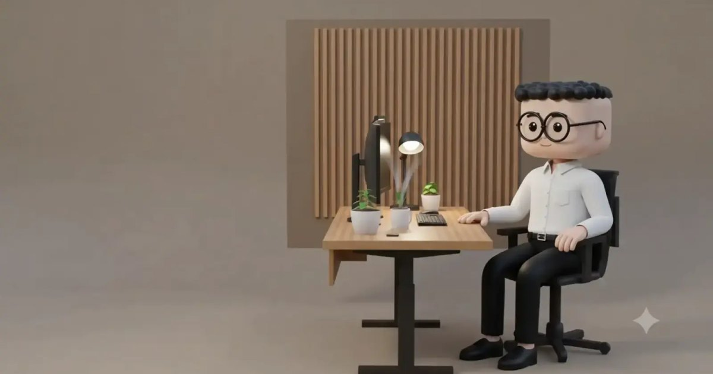

<div align="center">

# 🌏 Ansh Madaan — 3D Portfolio

**A portfolio you don't read — you *walk through it.***

Scroll it like a story, or press play and explore it like a game. 🎮

**[→ anshmadaan.vercel.app](https://anshmadaan.vercel.app)**



</div>

---

A warm, hand-built world where you **walk around (WASD)** and press **E** at the
desk, the mailbox, and the hamster to open Projects, Contact, and About — right
inside the scene. It even repaints itself to *your* local time of day. 🌅🌙

Made with **React 19 · Three.js · GSAP · Blender** — no templates, just too much
coffee and a hamster that refuses to stop running. 🐹

```bash
cd portfolio-3d && npm install && npm run dev
```

<div align="center">

**[anshmadaanmks@gmail.com](mailto:anshmadaanmks@gmail.com)** · [LinkedIn](https://www.linkedin.com/in/ansh-madaan-5362b92a8/) · [GitHub](https://github.com/Anshm1234)

</div>
